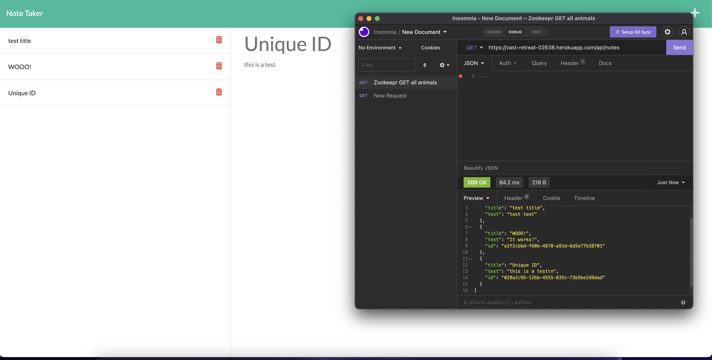
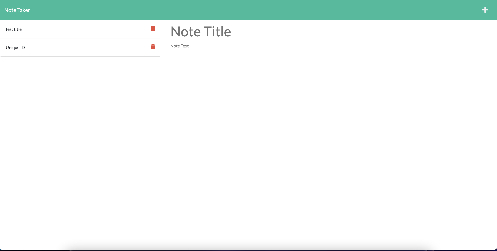

# CODENAME PROJECT NOTES
  
  
  ## Table of Contents ##
  *[Description](#description)

  *[License](#license)

  *[Languages](#languages)

  *[Installation](#installation)

  *[Usage](#usage)

  *[Contributing](#contributing)

  *[Questions](#questions)

  ## Description ##
  A handy dandy thinking application that let's you keep track and delete notes!
  
  An image showcasing the unique id generates for each array/note posted in insomnia. 

  
  An image showcasing the deletion of the note titled "WOOOO!"

  ## License ##
  This is licensed under MIT
  

  ## Installation ##
  npm i

  ## Tests ##
  npm test

  ## Usage ##
  There's code in here!

  ## Contributing ##
  Not much, you?

  ## Questions ##
  Github: [DEIVRS60](https://github.com/DEIVRS60)

  Email: david.reyes095@gmail.com

  
